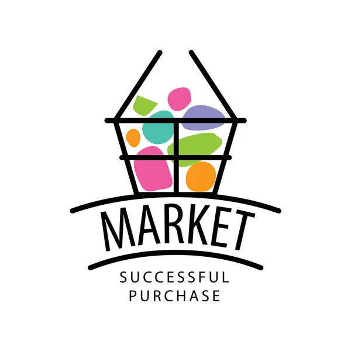

# Supermarket Sales Dashboard

## 1. Project Description 

 #### This project consists of analyzing data from a Supermarket Sales Database provided by Kaggle.
 #### After that, using the Dash library, I created a Dashboard for Data Visualization in WebApp format, and I deployed it in Render.com
 ### You can access the Dashboard in the link below
 #### This is the link for the WebApp: https://dashboard-supermarket-sales-yxwz.onrender.com

## 2. Main Objective 
#### The main objective of this project is to create an analysis Dashboard so that a director of a Supermarket Chain can clearly visualize his company's data and make better investment decisions. 

